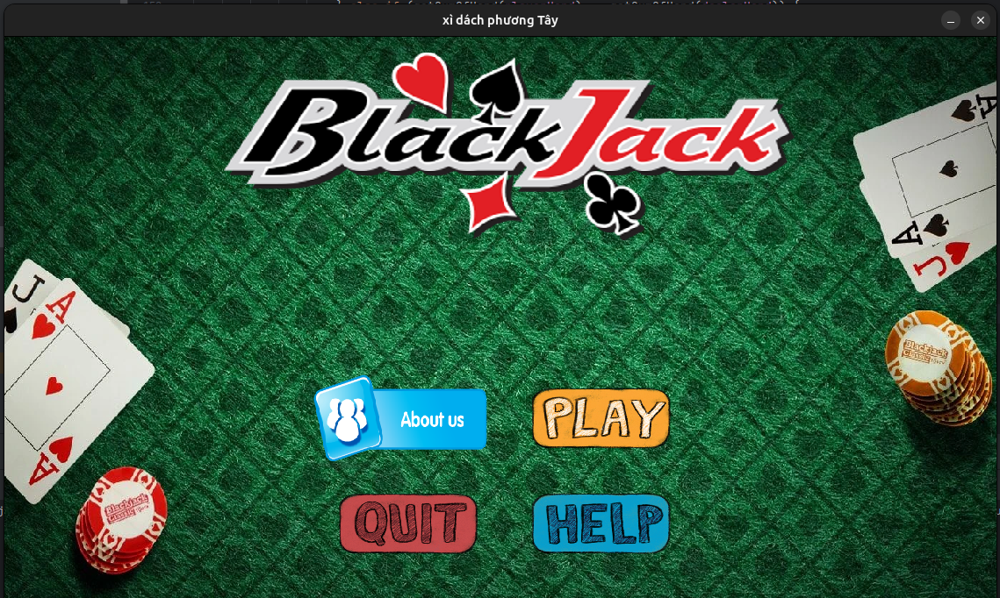
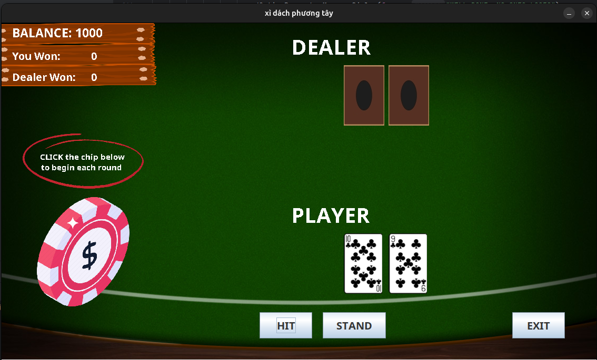

# BlackJack (Xi Dach) - OOP Project-International University-VNU-HCM

## Description
This project is an Object-Oriented Programming (OOP) implementation of the classic card game Blackjack. It is developed as part of a course at the International University - VNU-HCM.

The game simulates the interaction between a player and a computer dealer, following standard Blackjack rules. It is designed to demonstrate OOP principles such as encapsulation, inheritance, and polymorphism.

## Concepts
* Abstraction   
* Encapsulation  
* Inheritance  
* Polymorphism  
* Design Patterns: Singleton

## Installation

To install and run the project, follow these steps:

1. Clone the repository to your local machine:
```shell
git clone https://github.com/Drissdo185/BlackJackV2.git
```
2. Navigate to the project directory:
```shell
cd BlackJackV2
```
3. Run game
Open it in Visual Code 
```shell
code .
```
Or open manually in Intellij

## Overview
Firstly, you have to enter the amount you want to play

  
GUI gameplay



Select HELP if you don't know the rules

If you feel ok, click Play button to strat game.


Click the coin to make bet. 


Select the amount you want and enjoy the game !!!




## Contributing
Do Thanh Dat - ITDSIU21079  
Nguyen Ba Duy - ITDSIU21014  
Ngo Hoang Thanh - ITDSIU21119   
Pham Huynh Thanh Quan - ITDSIU21110

## License

Information about the project's license.


